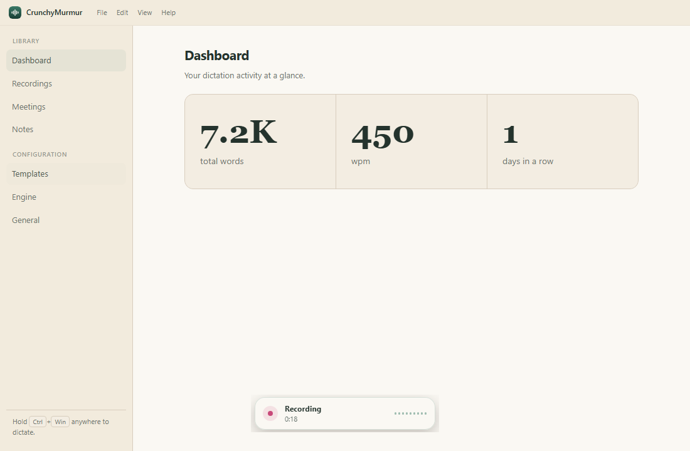
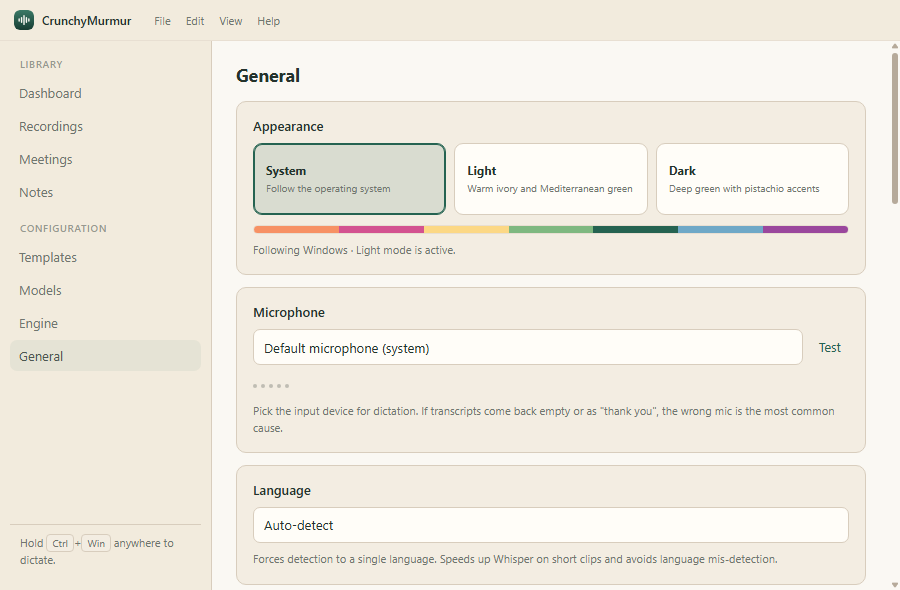
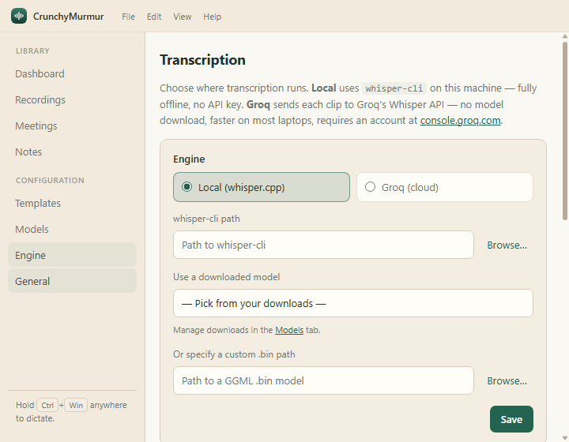
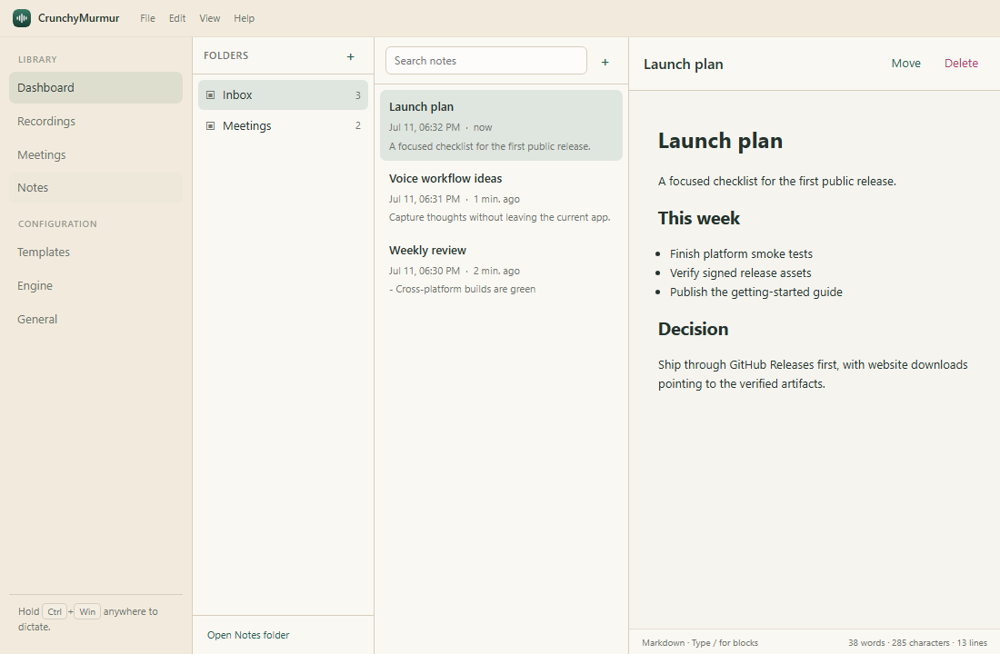
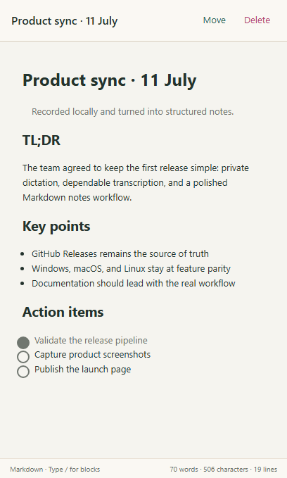

<div align="center">
  

  # CrunchyMurmur

  **Private-by-default voice dictation, meeting transcription, and Markdown notes.**

  Press a shortcut, speak, and keep working. CrunchyMurmur runs on Windows, macOS, and Linux, with local Whisper transcription or optional cloud providers.

  [](https://github.com/almoretti/CrunchyMurmur/releases/latest)
  [](https://github.com/almoretti/CrunchyMurmur/releases)
  [](https://github.com/almoretti/CrunchyMurmur/actions/workflows/ci.yml)
  [](https://github.com/almoretti/CrunchyMurmur/actions/workflows/codeql.yml)
  [](https://coderabbit.ai)
  [](docs/platform-support.md)
  [](LICENSE)

  [Download](https://github.com/almoretti/CrunchyMurmur/releases/latest) · [Documentation](docs/README.md) · [Report a bug](https://github.com/almoretti/CrunchyMurmur/issues/new/choose) · [Security](.github/SECURITY.md)
</div>



---

## What it does

| | Capability | What you get |
|---|---|---|
|  | **Dictation anywhere** | Hold the global shortcut, speak, and release to transcribe into the focused app. |
|  | **Meeting capture** | Record a microphone and, where supported, system audio as separate speaker-labelled tracks. |
|  | **A real Markdown workspace** | Edit notes, meeting notes, and reusable AI templates with write, split, and preview modes. |
|  | **Local-first privacy** | Use whisper.cpp fully offline. There is no account, advertising SDK, or project-operated telemetry. |
|  | **Useful progress, locally** | Track dictated words, weighted words per minute, and consecutive active days on your device. |
|  | **Verified releases and updates** | Signed packages, checksums, SBOMs, provenance attestations, and stable in-app updates from GitHub Releases. |

The interface is available in 12 languages — English, Italiano, Español, Português, Français, Deutsch, Dansk, Norsk, Svenska, 中文, 한국어, and 日本語. It follows your system language by default, and you can switch instantly in General settings.

## A calm, native-feeling workspace

| Appearance and device settings | Local and cloud transcription |
|---|---|
|  |  |

Screenshots use a clean automated test profile with no personal data or credentials.

## Notes that stay yours

| Markdown notes workspace | Focused note editing |
|---|---|
|  |  |

Notes are ordinary Markdown files in your Documents folder, so they remain portable, searchable, and usable with other editors.

## Install

Download the latest signed package from [GitHub Releases](https://github.com/almoretti/CrunchyMurmur/releases/latest), or use the verified terminal installer.

**Windows — PowerShell**

```powershell
irm https://raw.githubusercontent.com/almoretti/CrunchyMurmur/main/install.ps1 | iex
```

**macOS or Linux**

```sh
curl -fsSL https://raw.githubusercontent.com/almoretti/CrunchyMurmur/main/install.sh | sh
```

The scripts detect your operating system and architecture, download the latest release, and verify it against the published SHA-256 digest before installation. See [Getting started](docs/getting-started.md) for manual packages and first-run setup.

> CrunchyMurmur is preparing its first public signed release. Until one appears on the Releases page, build from source; the terminal installer and in-app updater intentionally refuse unpublished builds.

## Choose where transcription happens

- **Local whisper.cpp:** audio stays on your machine; no API key is required.
- **Groq Whisper API:** faster on many laptops; audio is sent to the Groq account you configure.
- **Optional AI formatting and notes:** use Anthropic, OpenAI, Groq, Claude Code, or Codex only when you configure and invoke them.

Cloud features are optional. Provider failures fall back safely without discarding the original transcript.

## Designed for trust

- No CrunchyMurmur account, analytics SDK, ads, or project-operated telemetry.
- API keys use operating-system-backed safe storage when available.
- Local data can be exported or permanently deleted from the app.
- Audio retention never removes meeting transcripts or notes.
- Release artifacts include SHA-256 checksums, an SPDX SBOM, and GitHub build-provenance attestations.
- Privileged Electron operations stay in the main process with constrained renderer APIs.

Read the complete [privacy notice](docs/legal/privacy.md), [security policy](.github/SECURITY.md), and [architecture overview](docs/architecture.md).

## Platform support

| | Windows | macOS | Linux |
|---|---|---|---|
| Packages | NSIS x64 / ARM64 | Universal DMG / ZIP | AppImage and Debian x64 / ARM64 |
| Default shortcut | Hold `Ctrl + Win` | Hold `Fn` | Configurable toggle |
| Meeting system audio | Supported | macOS 13+ | Microphone only |
| Automatic paste | Native | Accessibility permission | `wtype` or `xdotool` |
| Updates | Automatic | Automatic | Automatic for AppImage; reinstall for Debian |

See the [full capability matrix and Linux requirements](docs/platform-support.md).

## Updating

Packaged Windows, macOS, and Linux AppImage builds check stable GitHub Releases and download valid upgrades in the background. The app asks before restarting to install. Prereleases and downgrades are never applied.

You can also run the same terminal install command again at any time. Debian packages use this manual path. Read [Updating CrunchyMurmur](docs/updating.md) for exact behavior and verification options.

## Build from source

Requires Node.js 22.12 or newer and npm. Git is optional: the source bootstrap resolves `main` to an exact commit, downloads its GitHub archive, installs locked dependencies, validates the project, and launches it.

**Windows — PowerShell**

```powershell
& ([scriptblock]::Create((irm https://raw.githubusercontent.com/almoretti/CrunchyMurmur/main/scripts/source/run-from-source.ps1)))
```

**macOS or Linux**

```sh
curl -fsSL https://raw.githubusercontent.com/almoretti/CrunchyMurmur/main/scripts/source/run-from-source.sh | sh
```

The source is kept in a user-owned application-data directory, so running the command again safely rebuilds from the latest protected `main`. The previous working source tree is replaced only after the new commit passes dependency installation and validation. Read the scripts before piping them to a shell; options and manual commands are documented in [Building from source](docs/building-from-source.md).

Manual development setup remains available:

```sh
git clone https://github.com/almoretti/CrunchyMurmur.git
cd CrunchyMurmur
npm ci
npm run check
npm start
```

Native release packages must be built on their target platform. See [Contributing](.github/CONTRIBUTING.md) and [Releasing](docs/releasing.md).

## Documentation

- [Documentation index](docs/README.md)
- [Getting started](docs/getting-started.md)
- [Building from source](docs/building-from-source.md)
- [Features and providers](docs/features.md)
- [Platform support](docs/platform-support.md)
- [Updating](docs/updating.md)
- [Troubleshooting](docs/troubleshooting.md)
- [Architecture](docs/architecture.md)
- [Release process](docs/releasing.md)
- [Roadmap](docs/project/roadmap.md)
- [Project status](docs/project/status.md)
- [Support](docs/project/support.md)

## Contributing

Bug reports, focused pull requests, documentation improvements, and platform testing are welcome. Please read [Contributing](.github/CONTRIBUTING.md) and the [Code of Conduct](.github/CODE_OF_CONDUCT.md) first. Never post API keys, private calendar URLs, recordings, transcripts, or notes in a public issue.

CrunchyMurmur is released under the [MIT License](LICENSE). Use is also subject to the distributed [Terms of Use](docs/legal/terms.md).

The Markdown editing experience is powered by MarkText's MIT-licensed [Muya editor](https://github.com/marktext/marktext/tree/develop/packages/muya). See [third-party notices](docs/THIRD_PARTY_NOTICES.md) for attribution details.
